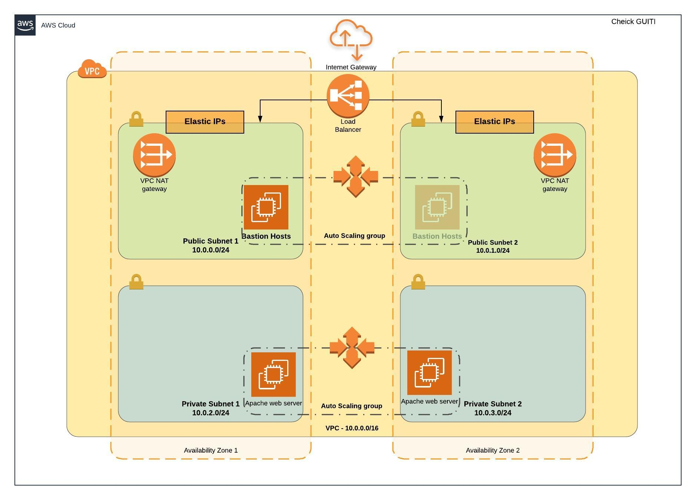

## Project Overview

# Deploy a high-availability web app using CloudFormation

In this project, we'll deploy web servers for a highly available web app using CloudFormation.
We will write the code that creates and deploys the infrastructure and application for an
Instagram-like app from the ground up. We will begin with deploying the networking components,
followed by servers, security roles and software. We’ll do it exactly as it’s done on the job,
following best practices and scripting as much as possible.

### Udagram Diagram

### Setup the Environment

* [Install AWS CLI](https://docs.aws.amazon.com/cli/latest/userguide/install-cliv2.html)
* [Configure AWS CLI](https://docs.aws.amazon.com/cli/latest/userguide/cli-chap-configure.html)

### Folder content

1. Diagram Architechture
2. Helper scripts
    - `./create-stack.sh` `STACK_NAME` `TEMPLATE_BODY` `TEMPLATE_PARAMETERS`
    - `./update-stack.sh` `STACK_NAME` `TEMPLATE_BODY` `TEMPLATE_PARAMETERS`
    - `./delete-stack.sh` `STACK_NAME`
3. Network template: `udagram-network.yml`
4. Network parameter: `udagram-network-params.json`
5. Server template: `udagram-servers.yml`
6. Server parameter:  `udagram-servers-params.json`

### Deployment

in order to create all your Infrastructure As Code, your will need launch the script as follow:

- Create the Network stack:
    - `./create-stack.sh` `ENTER_YOUR_NETWORK_STACK_NAME_HERE` `udagram-network.yml` `udagram-network-params.json`
    * Wait until your stack creation is completed and you launch your servers stack creation.
- Update the Network stack:
    - `./update-stack.sh` `ENTER_YOUR_NETWORK_STACK_NAME_HERE` `udagram-network.yml` `udagram-network-params.json`
    * This script should be used only if you have made some changes in your scripts

- Create the Server stack:
    - `./create-stack.sh` `ENTER_YOUR_SERVER_STACK_NAME_HERE` `udagram-servers.yml` `udagram-servers-params.json`
    * Check your AWS Console to see if everything is working as expected.
- Update the Server stack:
    - `./update-stack.sh` `ENTER_YOUR_server_STACK_NAME_HERE` `udagram-servers.yml` `udagram-servers-params.json`
    * This script should be used only if you have made some changes in your scripts

## [Important] Troubleshooting with SSH

You may need to add a `KeyName` parameter and create your own key to connect on your instances for troubleshooting if needed.
Also, make sure to change the `CidrIp` in `BastionSecurityGroup` with your own `ÌP` for SSH connection or you may remove this part if you don't SSH.